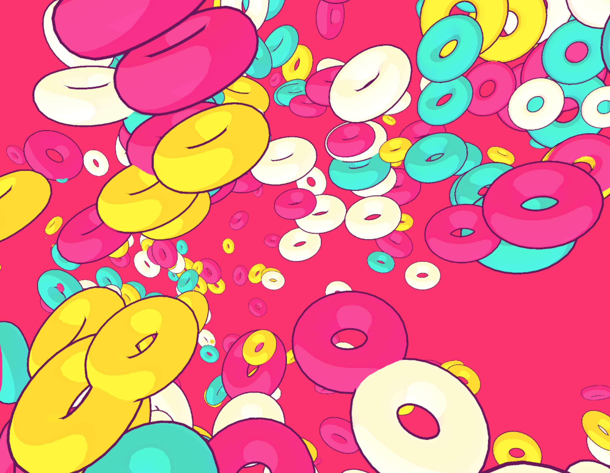
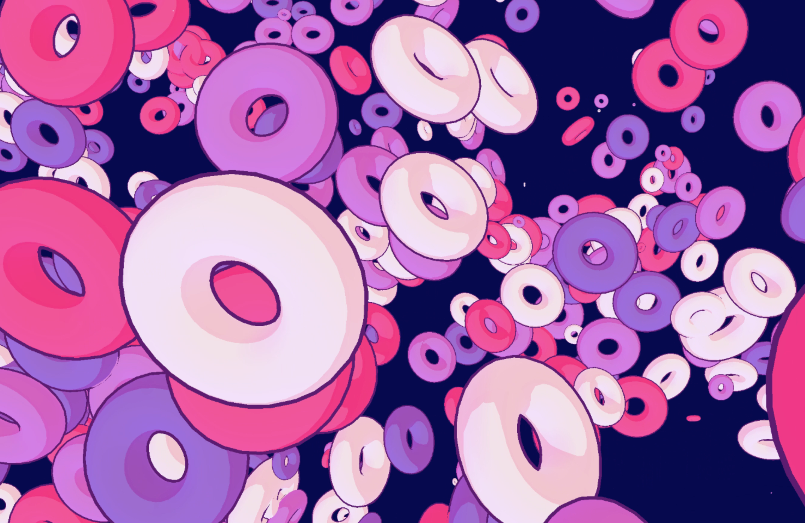

# Toon Shading
  
* [demo](https://mnmxmx.github.io/toon-shading/dst/)  
* [how to implement toon shading with webgl (in Japanese)](https://wgld.org/d/webgl/w048.html)  
  
[](./screenshot1.png)  
[](./screenshot2.png)   
  
## Usage  
* Clone repository  
* Install Node.js  
* Run following commands  
```
  npm install  
  npm start  
```

